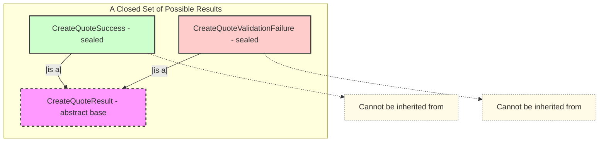
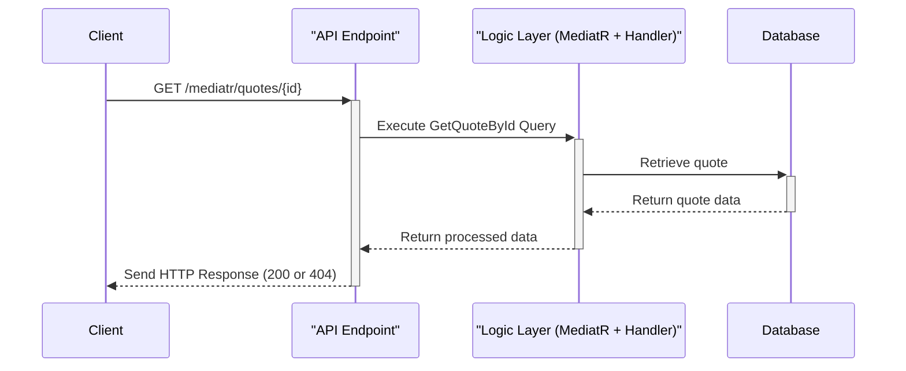
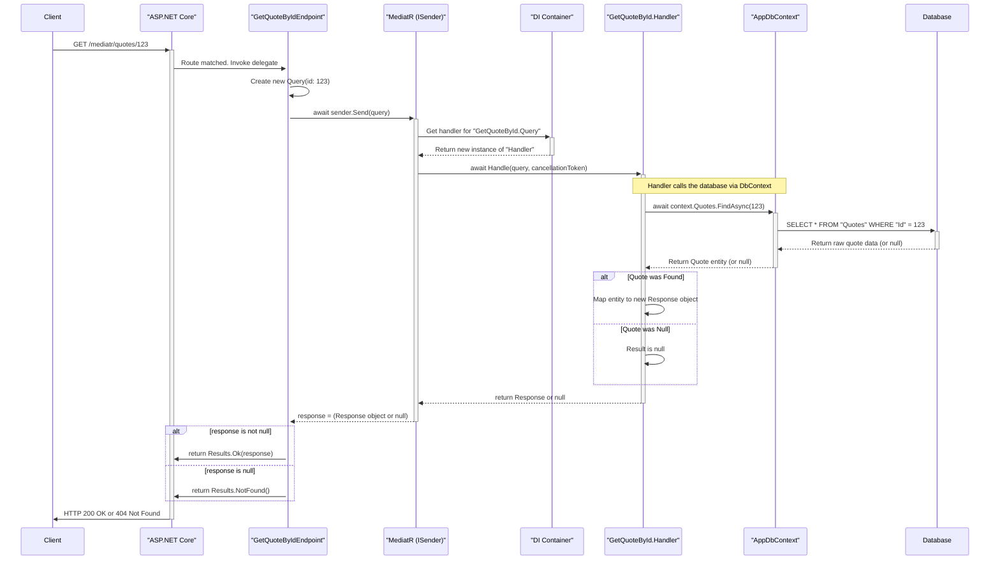

# Contains
- .Net 9 Minimal WebAPI
    - IEndpoint & EndpointExtensions configuration
- EF Core (SqlLocalDB)
- Scalar
- Global Exception Handling
- Serilog
- MediatR 

## New for this template :point_down:
- ~~Discriminated Union (DU) Pattern~~
- Results Pattern (Credit @ [Milan Jovanovic](https://github.com/m-jovanovic))
- Composite Pattern
- Fluent Validation
---
# Notes  

### Whats up with the Results Pattern?  

**The Core Problem It Solves:**
In programming, almost every method or operation can have two outcomes: it can succeed or it can fail. The traditional ways of communicating this are often problematic:
*   **Returning `null` on failure:** This is ambiguous. Does `null` mean "not found," "an error occurred," or something else? It forces the calling code to constantly check for nulls.
*   **Throwing exceptions for logical errors:** Throwing an exception for a predictable failure (like "user input was invalid" or "item not found") is a misuse of exceptions. Exceptions are computationally expensive and should be reserved for truly *unexpected*, system-level problems (like a database being offline).

**The Solution (The Result Pattern):**
The Result pattern provides a simple and elegant solution. Instead of returning the desired value directly or throwing an exception, a method returns a special "wrapper" object—the `Result` object.

Think of it like receiving a package in the mail. The `Result` object is the package.
1.  **The Label (`IsSuccess`):** The first thing you do is check the label on the package. This tells you if the delivery was successful or if there was a problem.
2.  **The Contents:**
    *   If the label says **"Success,"** you can open the package and get your gift (the `Value`).
    *   If the label says **"Failure,"** you don't get a gift. Instead, the package contains a note explaining what went wrong (the `Error`).

This pattern makes the outcome of any operation **explicit, unambiguous, and type-safe.**

### A Fair Results Pattern Implementation

Our implementation is a robust and feature-rich version of this pattern, composed of a few key building blocks:

**1. The `Error` Record: A Structured Failure**
*   **What it is:** A small, immutable object that describes a single failure.
*   **Key Features:** Instead of just using a `string` for an error, our `Error` object contains:
    *   A machine-readable `Code` (e.g., "Orders.NotFound").
    *   A human-readable `Description`.
    *   A semantic `ErrorType` enum (`NotFound`, `Validation`, `Conflict`, etc.).
*   **Why it's smart:** This structure allows our API layer to inspect the `ErrorType` and automatically map it to the correct HTTP status code (e.g., `NotFound` becomes a `404 Not Found`).

**2. The `Result` and `Result<T>` Classes: The Core Wrapper**
*   **What it is:** The "package" itself. It holds the outcome of an operation.
*   **Key Features:**
    *   **The Flag (`IsSuccess`):** The boolean "label" that tells us if the operation succeeded.
    *   **The Value (`Result<T>.Value`):** For operations that return data (like `GetUserById`), this property holds the successful data. We've designed it to throw an exception if you try to access it on a failed result, enforcing safe coding practices.
    *   **The Error (`Error`):** Holds the `Error` object if `IsSuccess` is false.
    *   **Factory Methods (`Result.Success()`, `Result.Failure(...)`):** Provides a clean, readable way to create result objects.
    *   **Implicit Operator:** A "quality of life" feature that allows you to return a value directly from a method (`return customer;`), and it will be automatically wrapped in a `Result.Success(customer)`.

**3. The `ValidationError` Record: The Composite Error**
*   **What it is:** A specialized type of `Error` that acts as a container for *other* errors.
*   **Key Features:**
    *   It inherits from `Error`, so it can be used anywhere an `Error` is expected.
    *   It contains an `Errors` array, allowing it to bundle multiple validation failures into a single object.
*   **Why it's smart:** This solves the common problem of returning all validation errors to a user at once, rather than making them fix one error at a time. It's a perfect example of the **Composite Design Pattern**.

These three core features combine to form an interconnected **system** for handling operational outcomes. This system is:
*   **Explicit:** The possible outcomes are clear from the method signature.
*   **Safe:** It prevents common bugs like null reference exceptions and forces developers to handle failures.
*   **Maintainable:** It provides a consistent, reusable way to handle success and failure across the entire application.
---
### Deeper Dive: The Why and How (The Composite Pattern)

The purpose of this class is to solve a very common problem: **How do you return all validation errors at once?**

Imagine you are validating a user registration request. You might need to check several things:
*   Is the email in a valid format?
*   Is the password strong enough?
*   Is the username already taken?

If you only returned the *first* error you found, the user would have a frustrating experience, fixing one error at a time only to be told about the next one. The best practice is to return all errors at once.

This `ValidationError` class enables exactly that.

#### How It's Used in Practice

Let's imagine you have a method that validates multiple properties. It can use `ValidationError.FromResults` to aggregate all the failures into a single, comprehensive error object.

```csharp
public class UserRegistration
{
    // ... properties for Email, Password, Username ...

    public Result Validate()
    {
        // Validate each property or rule independently.
        // Each of these methods would return a Result (either Success or Failure).
        var emailResult = ValidateEmailFormat();
        var passwordResult = ValidatePasswordStrength();
        var usernameResult = CheckIfUsernameIsUnique();

        // Put all the individual results into a list.
        var results = new List<Result> { emailResult, passwordResult, usernameResult };

        // Check if any of them failed.
        if (results.Any(r => r.IsFailure))
        {
            // If so, create a single ValidationError that contains
            // the Error objects from all the failed results.
            return ValidationError.FromResults(results);
        }

        // If all results were successful, return a general success.
        return Result.Success();
    }
}
```

**What is the return value?**

*   If all validations pass, the method returns `Result.Success()`.
*   If the email is invalid and the password is too weak, the method returns a single `ValidationError` object. That object's `Errors` property will contain *two* `Error` objects inside it: one for the email failure and one for the password failure.

This pattern is incredibly powerful because the consuming code (e.g., your API endpoint) only has to handle one `Result` object, but it can still access all the detailed error information if it needs to.

---
### Fluent Validation


## Previous Notes
<details><Summary>:scroll: Previous Notes</Summary>  

## Discriminated Unions
  - Used here to clearly indicate return type from MediatR handlers.
```csharp
public abstract record CreateQuoteResult;
public sealed record CreateQuoteSuccess(int NewQuoteId) : CreateQuoteResult;
public sealed record CreateQuoteValidationFailure(string ErrorMessage) : CreateQuoteResult;

...
public async Task<CreateQuoteResult> Handle(CreateQuoteCommand request, CancellationToken cancellationToken)
{
     return new CreateQuoteValidationFailure("Author and Content are both required.");
     ...
     return new CreateQuoteSuccess(quote.Id);
}

return result switch
{
    CreateQuoteSuccess s => Results.CreatedAtRoute("GetQuoteById", new { id = s.NewQuoteId }),
    CreateQuoteValidationFailure f => Results.BadRequest(f.ErrorMessage),
    _ => Results.StatusCode(500)
};
```
Of course. This is a fantastic question because `sealed` is a simple keyword, but in this specific context, it is a critical part of a powerful and modern C# pattern.

### The Direct Meaning of `sealed`

In C#, the `sealed` modifier, when applied to a class or record, means one thing:

**"This type cannot be inherited from."**

It marks the type as the final, complete version in its inheritance chain. You are explicitly forbidding any other developer from creating a new class that derives from it.

For example, this would be illegal and cause a compiler error:

```csharp
// This will NOT compile because CreateQuoteSuccess is sealed
public record SpecialSuccess(int Id, string Message) : CreateQuoteSuccess(Id);
```

### The Pattern: Discriminated Unions

The use of `sealed` here is essential to implementing a design pattern called a **Discriminated Union** (also known as a sum type, tagged union, or a closed type hierarchy).

A Discriminated Union is a type that can hold a value from a **fixed, closed set** of other types.

Let's break down how your code creates this pattern:

1.  **The Abstract Base (`CreateQuoteResult`):**
    *   This is the "umbrella" or the "union" type. It defines the common concept: "a result from the create quote operation."
    *   It's `abstract`, which means you can never create an instance of it directly. It exists only to be inherited from.

2.  **The Sealed Implementations (`CreateQuoteSuccess`, `CreateQuoteValidationFailure`):**
    *   These are the distinct, possible, concrete outcomes. A `CreateQuoteResult` will always be *one of these specific types*.
    *   The `sealed` keyword is the key. By sealing these derived records, you are telling the compiler and other developers: "These are the **only** possible outcomes. This set is complete and cannot be extended."

This pattern guarantees that a variable of type `CreateQuoteResult` can *only* hold an instance of `CreateQuoteSuccess` or `CreateQuoteValidationFailure`. There are no other possibilities.

### Conceptual Diagram

Here is a diagram illustrating the concept. Think of the Discriminated Union as a container that can only hold one of its pre-defined shapes.



### Why This Pattern is a Best Practice

Using a Discriminated Union is vastly superior to older error-handling methods for several reasons:

1.  **Clarity and Honesty:** Your method signature `Task<CreateQuoteResult>` is extremely honest. It clearly states, "I will return a `CreateQuoteResult`, which you know can be either a success or a validation failure." It makes the possible outcomes explicit.

2.  **No More `null` Checks:** You don't return `null` to indicate failure. Returning `null` is ambiguous—was it a failure? Was the object not found? This pattern replaces `null` with a rich, descriptive failure object.

3.  **No Exceptions for Predictable Errors:** For predictable failures like user validation errors, throwing exceptions is considered an anti-pattern. Exceptions are for *exceptional*, unexpected events. This pattern handles validation as a normal, expected outcome of the operation, leading to cleaner and more performant code (no `try-catch` blocks for simple validation).

4.  **Enables Exhaustive `switch` Expressions:** This is the biggest benefit. Because the set of outcomes is *closed* and *known*, the compiler can help you write safer code. When you use a `switch` expression to handle the result, the compiler knows all possible types and can warn you if you forget to handle one.

    ```csharp
    // The compiler knows that 'result' can only be Success or ValidationFailure.
    // This makes your code more robust.
    return result switch
    {
        CreateQuoteSuccess s => Results.Ok(s),
        CreateQuoteValidationFailure f => Results.BadRequest(f.ErrorMessage),
        // If you were to add a third sealed result type and forget it here,
        // the compiler would warn you that your switch is not exhaustive!
    };
    ```

In summary, `sealed` is the linchpin that locks down your inheritance hierarchy, turning a simple set of classes into a powerful, type-safe, and highly expressive Discriminated Union pattern.


---
## MediatR Flow
- ex: Api.Features.Quotes.GetQuoteById.cs

1.  **Handler Collection (Correct!)**: At application startup, the dependency injection (DI) container scans your project's assemblies for any class that implements `IRequestHandler<TRequest, TResponse>`. It registers each of these handlers so that MediatR knows which class is responsible for handling which specific request type. In your case, it registers `GetQuoteById.Handler` as the designated handler for `GetQuoteById.Query`.

2.  **ISender (Correct!)**: Precisely. `ISender` is a lightweight interface provided by MediatR whose sole purpose is to "send" a request object into the MediatR pipeline. You request it from the DI container (in Minimal APIs, this happens automatically via parameter binding, which is what `[FromServices]` would do under the hood). When you call `sender.Send(new GetQuoteById.Query(id))`, MediatR looks at the type of the object you passed in (`GetQuoteById.Query`) and says, "Aha! I have `GetQuoteById.Handler` registered for this type." It then resolves an instance of that handler from the DI container and invokes its `Handle` method, passing along your query object.

### Summary of the Flow

1.  **Request Initiation**: A client sends a `GET` request to your API.
2.  **Routing**: ASP.NET Core's routing middleware matches the URL (`/mediatr/quotes/{id}`) and determines that the `GetQuoteByIdEndpoint` delegate should handle it.
3.  **Endpoint Execution**: The delegate is invoked. The framework provides the `ISender` service and the `id` from the URL.
4.  **Query Creation**: Inside your endpoint, you create an instance of the `GetQuoteById.Query` record, encapsulating the data needed for the operation.
5.  **Dispatch**: You call `sender.Send()` with the query object. This hands control over to MediatR.
6.  **Handler Resolution**: MediatR asks the Dependency Injection container for the handler registered for `GetQuoteById.Query`. The DI container creates an instance of `GetQuoteById.Handler`, injecting its required dependency (`AppDbContext`).
7.  **Business Logic**: MediatR invokes the `Handle` method on the handler instance. The handler executes the core logic: it uses the `AppDbContext` to query the database for the quote.
8.  **Data Retrieval**: The handler awaits the database call.
9.  **Response Mapping**:
    *   If a quote is found, the handler maps the database entity to the `GetQuoteById.Response` record and returns it.
    *   If not found, it returns `null`.
10. **Return to Sender**: The response (`Response` object or `null`) travels back up the call stack from the handler to MediatR, and finally `sender.Send()` returns that result to your endpoint delegate.
11. **HTTP Result**: The endpoint delegate checks the returned value and uses ASP.NET Core's `Results` helpers to create the appropriate HTTP response (`200 OK` with the data or a `404 Not Found`).

### Diagrams of the flow  
  
#### High Level

  
#### Detailed Flow  

---
# VSA Implementations: Nested Static vs. Separate Classes/Files
Of course. This is an excellent comparison to make, as it highlights a fundamental choice in code organization when using the "feature slice" architecture.

At a glance, the two implementations are **functionally identical**. They will compile to the same underlying logic and behave exactly the same at runtime. The difference between them is purely a matter of **code organization and developer ergonomics**.

Let's break them down.

---

### Implementation #1: The Nested Static Class Approach

```csharp
public static class CreateQuote
{
    // All related classes are nested inside
    public sealed record CreateQuoteCommand(...) : IRequest<HandlerResult>;
    public abstract record HandlerResult;
    public sealed record HappyResult(...) : HandlerResult;
    public sealed record FailResult(...) : HandlerResult;

    public sealed class CreateQuoteHandler(...) : IRequestHandler<...>
    {
        // ...
    }

    public sealed class CreateQuoteEndpoint : IEndpoint
    {
        // ...
    }
}
```

This pattern uses a `static` class as a "namespace" or a grouping mechanism for all the code related to a single feature.

#### Pros:

*   **High Cohesion and Discoverability:** This is the biggest advantage. Everything related to the `CreateQuote` feature is in **one file**. When you need to work on this feature, you open `CreateQuote.cs` and see the command, the possible results, the handler logic, and the API endpoint definition all at once. There is no need to navigate between multiple files.
*   **Encapsulation:** The `CreateQuote` static class acts as a boundary. It prevents the `HappyResult` or `FailResult` of this feature from being accidentally used by another feature. You would have to be explicit (`var result = new CreateQuote.HappyResult(...)`) which makes the code's intent clearer.
*   **Reduced Friction:** To add a new feature, you can simply copy the file, rename the parent static class (e.g., to `DeleteQuote`), and modify the internals. This is a very fast development workflow.
*   **Clean Global Namespace:** It avoids polluting the global namespace with many similarly named classes like `CreateQuoteCommand`, `UpdateQuoteCommand`, `DeleteQuoteCommand`, etc.

#### Cons:

*   **Potential for Large Files:** For a very complex feature with multiple commands, queries, and extensive logic, this single file could become long and potentially difficult to navigate.
*   **Slight Unfamiliarity:** For developers coming from a traditional MVC background or other language ecosystems, the idea of nesting multiple public types in a single file might seem unusual at first.

---

### Implementation #2: The Separate Top-Level Classes Approach

```csharp
// Each class is its own top-level type, likely in its own file
// within a "Features/Quotes" folder.
public sealed record CreateQuoteCommand(...) : IRequest<HandlerResult>;
public abstract record HandlerResult;
public sealed record HappyResult(...) : HandlerResult;
public sealed record FailResult(...) : HandlerResult;
public sealed class CreateQuoteHandler(...) : IRequestHandler<...> { }
public sealed class CreateQuoteEndpoint : IEndpoint { }
```

This pattern adheres to the more traditional C# convention of "one public type per file," where the folder structure provides the organization.

#### Pros:

*   **Adherence to Convention:** This strictly follows the common "one class per file" principle, which can be enforced by team standards or linters.
*   **Clear Test Separation:** It can feel slightly more straightforward to write unit tests when each class is in its own file. You create a test file like `CreateQuoteHandlerTests.cs` that targets only the `CreateQuoteHandler.cs` file.
*   **Scalability for Complexity:** If a feature becomes extremely large, having its components broken out into separate files can make the solution explorer easier to manage than one very large file.
*   **Familiarity:** This structure is immediately recognizable to almost any C# developer, regardless of their architectural background.

#### Cons:

*   **Lower Cohesion (File System Level):** To understand the entire feature, you must open and navigate between multiple files (`CreateQuoteCommand.cs`, `CreateQuoteHandler.cs`, `CreateQuoteEndpoint.cs`, etc.). This can slow down development and cognitive understanding.
*   **Increased File Count:** This approach leads to a proliferation of files. A project with 50 features could easily have over 200 files just for the feature logic, which can make the solution explorer feel cluttered.

---

### Side-by-Side Comparison

| Aspect | Implementation #1 (Nested Static) | Implementation #2 (Separate Classes) |
| :--- | :--- | :--- |
| **Cohesion** | **Very High.** All related code lives in one file. | **Lower.** Code is spread across multiple files within a folder. |
| **File Organization** | One file per feature. | One file per class; multiple files per feature. |
| **Discoverability** | **Excellent.** Open one file to see everything. | **Good.** Navigate a folder to see all parts. |
| **Encapsulation** | **Strong.** The static class acts as a namespace. | **Standard.** The folder acts as a namespace. |
| **Testability** | Good. | Excellent and very traditional. |
| **Scalability** | Best for small-to-medium features. | Scales well for very large and complex features. |
| **Developer Friction**| **Low.** Easy to add new features by copying a file. | **Slightly Higher.** Requires creating multiple files for a new feature. |

### Conclusion: Which is Better?

There is no single "correct" answer, as it's a strategic choice based on team preference and project style. However, in the context of modern .NET and CQRS architectures:

**Implementation #1 (Nested Static Class) is often preferred** and is gaining significant popularity. It optimizes for the most common development task: working on a single, vertical slice of functionality. The high cohesion and low friction it provides are powerful benefits for developer productivity.

**Implementation #2 (Separate Classes) is a perfectly valid and robust alternative.** It is a safer, more traditional choice if your team has a very strong preference for the "one class per file" rule or if you regularly build extremely complex features where a single file would become unwieldy.

Ultimately, both approaches achieve the same excellent architectural outcome. The choice is about how you want to organize your code on disk to best suit your team's workflow.  

</details>
